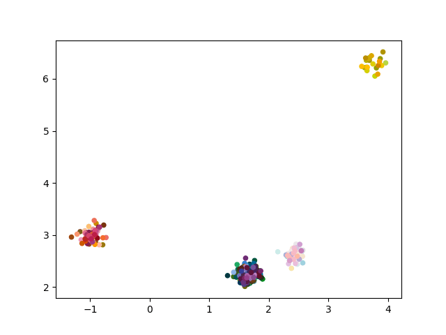
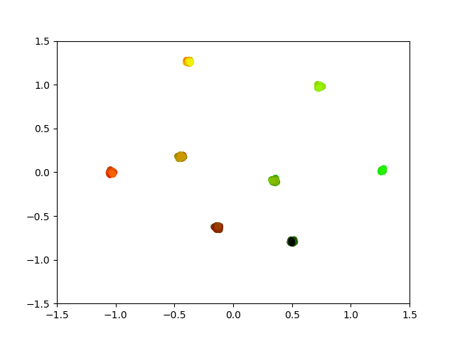

# vqvib_neurips2022
Codebase for VQ-VIB implementation and color experiments based on "Trading off Utility, Informativeness, and Complexity in Emergent Communication" NeurIPS 2022.

Below, we provide visualizations for the communication space of VQ-VIB agents (left), and how they discretize their input space (right).
The top row corresponds to results from a color reference game, while the bottom row comes from training agents to navigate a particle world.
In both environments, agents learn to discretize the space into increasingly coarse clusters as complexity decreases, and nearby vectors in the communication space encode similar meanings.

|                            PCA of VQ-VIB Comm.                             |                              Modemaps of VQ-VIB                               |
|:--------------------------------------------------------------------------:|:-----------------------------------------------------------------------------:|
|      |        |
|  |  |


In this repo, we provide the minimal code to allow you to train agents (including VQ-VIB agents) in a color reference game, reproducing the complexity control from the top figures.

# Getting Started

1. Install the requirements listed in requirements.txt.

    ```
    pip install -r requirements.txt
    ```

2. Add the ib-color-naming submodule.

    We depend upon code from Noga Zaslavsky's ib-color-naming github repo. Add it as a submodule via:
    
    ```
    git submodule add https://github.com/nogazs/ib-color-naming ib_color_naming
    ```

3. Lastly, download the IB Color Naming model from Noga Zaslavsky's prior color naming work:

    https://www.dropbox.com/s/70w953orv27kz1o/IB_color_naming_model.zip?dl=1

   Put the contents of the zip file inside a directory called ``models``

    Your directory structure should look like this:
    
    ```
    vqvib_neurips2022/
         -data
           -wcs
         -ib_color_naming
         -models
           -IB_color_naming_model
              -model.pkl
         -saved_data
         -src
           -data
           -models
           -scripts
           -settings
           -utils
    ```

4. Now let's run code. 

    All scripts will be run from the vqvib directory. Not inside ``src`` or anything like that.
    
    If you just want to run a single script, run ``main.py``. Again, we assume you run from vqvib, so the flow on a terminal may look like:
    
    ```
    cd ~/src/vqvib_neurips2022
    python src/scripts/main.py
    ```
    
    That's it! No arguments or anything like that.
    There are essentially arguments hardcoded at the bottom of the script.

Now, to actually see results, look around in the saved_data dir.
There should be a folder created for each epoch in training, with a snapshot of performance and what communication looked like.
E.g., there's PCA of the communication vectors, colored by the color used to generate the communication.
Or there are plots of capacity and accuracy across all epochs up to that point.

There are also two special folders called 'pca' and 'modemaps' that save snapshots of the PCA of communication and modemaps of colors, respectively.
These are just copies of images already saved in the incremental snapshots, but it can be easier to visualize the changes in communication by clicking through a single folder.

## Key settings:
| Name                     | Description                                                                                                                                |
|--------------------------|--------------------------------------------------------------------------------------------------------------------------------------------|
| comm_dim                 | Dimensionality of communication vectors. For most methods, that allows vectors in, e.g., R^32. For onehot, that specifies how many tokens. |
| kl_incr                  | By how much to increase the weight of the KL loss every time we update it in training. This is like the annealing step size.               |                                                                                                                                  |
| obs_noise_var            | Variance of the Gaussian noise used to corrupt the speaker's observation in CIELAB space                                                   |
| plotting_freq            | How frequently (in epochs) to generate plots for the communications. Plotting can slow things down.                                        |
| recons_weight            | Weight for reconstruction loss. Try to decode the speaker's observation from the communication. This is lambda_I in the paper.             |
|                          |                                                                                                                                            |
|                          |                                                                                                                                            |
| Other important settings |                                                                                                                                            |
| vq_loss in vq.py         | Here, we calculate a differentiable approximation over which prototypes are used.                                                          |
| Speaker class            | We choose the speaker class by just setting the string at the bottom of main.py. Just comment out the one you want.                        |

## Code Structure

There's one main script that does the training.

The models are all under models. The ``team`` in team.py brings together a speaker, listener, and decoder.
The other modules are mostly just different architectures for different types of communication.


## Integration with IB code
This code integrates with Noga Zaslavsky's IB code (https://github.com/nogazs/ib-color-naming) by adding it as a submodule.
The integration should already be done - we call various methods for calculating gNID, plotting the IB bound, etc.

There appears to be a memory leak issue in calling parts of the IB code related to modemaps; there's a comment to this effect in main.py.
The current "solution" is to just not call that code often.

## Interesting experiments
Below, we list (some of) the ways one can induce interesting new behaviors by changing just a few hyperparameters.

1) Change ``recons_weight`` to measure the effect of our informativeness loss. Greater weights should induce faster convergence to greater complexity and informativeness.
2) Within ``vq.py`` change the weight penalizing the categorical entropy loss, as discussed in Section 3.2.4 of the NeurIPS paper. In theory, a small weight is sufficient to bias agents to lower-entropy naming patterns. Greater weights induce lower entropy but also start affecting complexity. Further investigation of complexity and categorical entropy losses could be interesting.

## Citation

If you found this code useful, please cite the NeurIPS paper!

If you have questions, please reach out to Mycal Tucker at mycal@mit.edu.

